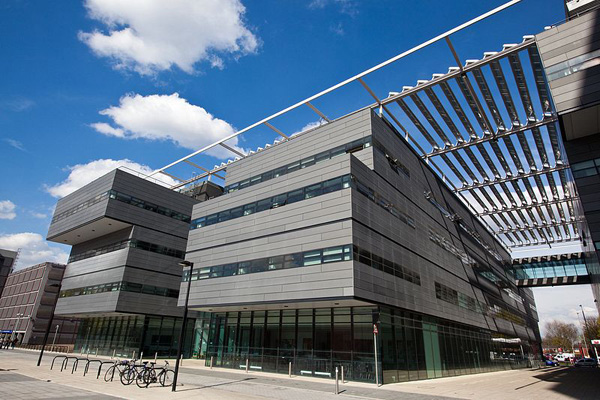

The University of Manchester SIAM-IMA Student Chapter encourages the promotion of applied mathematics and computational science to students, especially, but not limited to, graduate students.
The Chapter was set up in December 2009, and is run by a committee of PhD students at [The University of Manchester](http://www.manchester.ac.uk), with help from our Faculty Advisors [David Silvester](http://www.maths.manchester.ac.uk/djs/) and [Marcus Webb](https://personalpages.manchester.ac.uk/staff/marcus.webb/).

After a period of inactivity, the student chapter is up and running again!

## Computational Skills Workshop

After a period of inactivity, we are happy to announce that we are running a workshop with talks focused on scientific computing and code development, which are to be given by PhD students.

## SIAM and IMA

A student membership for [SIAM](https://www.siam.org/) is free of charge for all students of the University of Manchester.
If you are not yet a member, you can apply [here](https://www.siam.org/membership/individual-membership/).

Information on student memberships for the IMA can be found [here](https://ima.org.uk/membership/membership-grades/student/).

### Manchester SIAM-IMA Student Chapter Conference 2023

We are proud to have organized the Manchester SIAM-IMA Student Chapter Conference 2023 on 27 April 2023.

  

